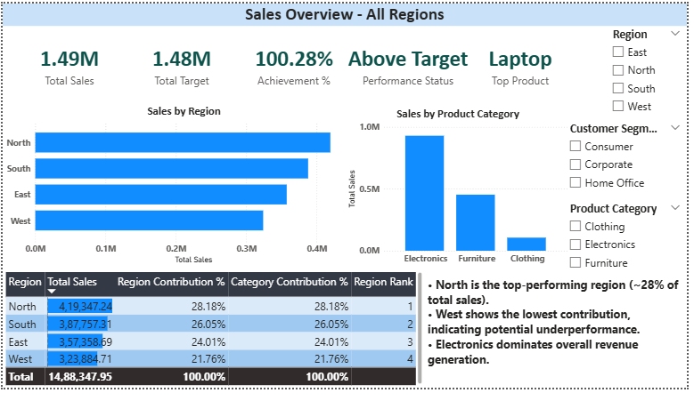
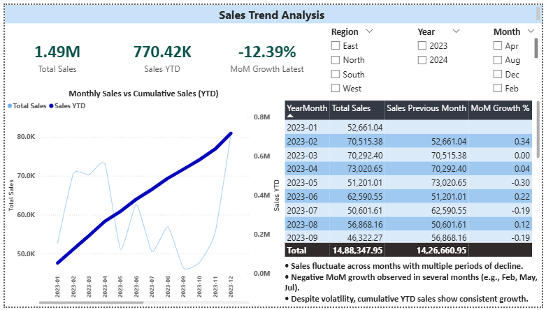

# Sales Performance Dashboard (Power BI)

## 📊 Project Overview
This project analyzes sales performance across regions and time using Power BI. It focuses on identifying trends, regional performance, and business insights using interactive dashboards.

## 🛠 Tools Used
- Power BI
- DAX (Data Analysis Expressions)
- Data Modeling (Star Schema)

## 📌 Key Features
- KPI Cards: Total Sales, Total Target, Achievement %, Performance Status
- Regional Analysis with ranking and contribution %
- Time Intelligence: YTD and Month-over-Month Growth
- Interactive slicers (Region, Year, Month, Segment, Category)

## 📈 Insights
- Sales fluctuate across months with multiple periods of decline.
- Negative MoM growth observed in several months.
- YTD sales show consistent growth despite short-term volatility.
- North region contributes the highest share of revenue.

## 📷 Dashboard Preview

### Overview Page

### Trend Analysis Page

## 📁 Files
- Sales_Analysis_Dashboard.pbix
- 
